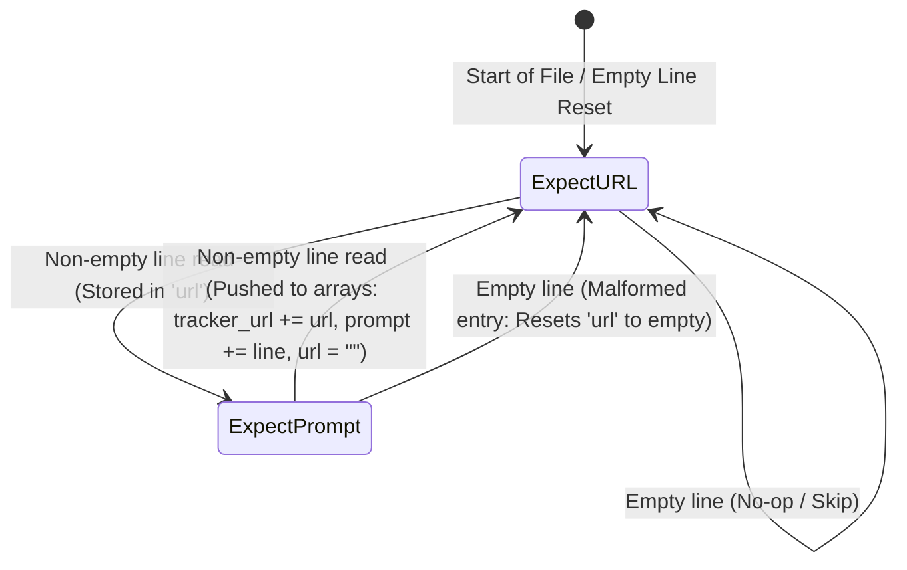
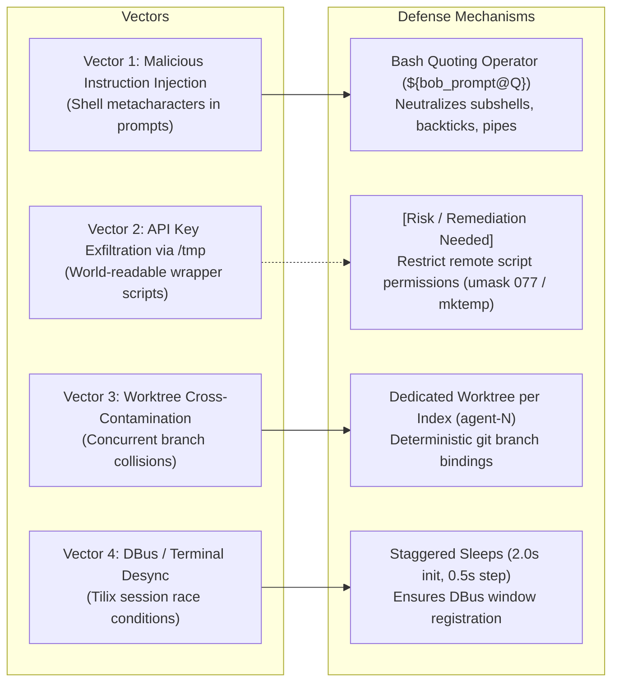
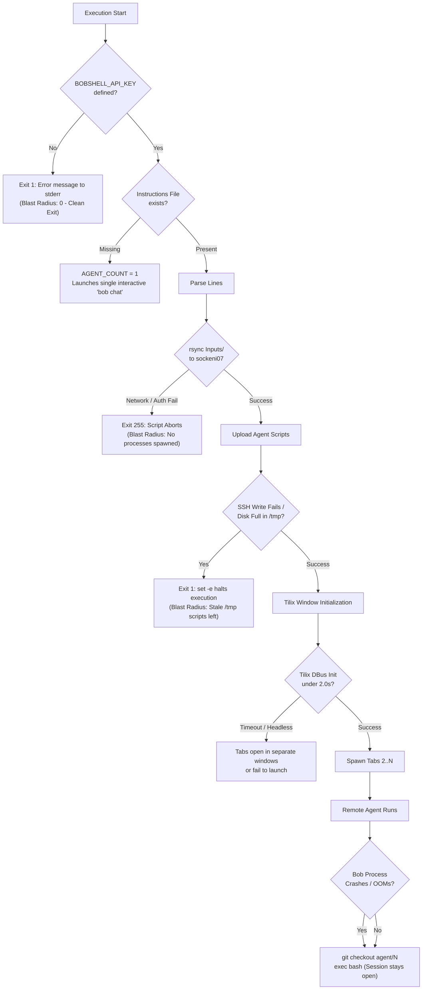

# Whiteboard Defense: `launch-bob-agents.sh`

This document provides a comprehensive system architecture, technical defense, adversarial threat model, failure analysis, and operational triage playbook for `launch-bob-agents.sh`, conforming to the enterprise Whiteboard Defense standard.

---

## 1. High-Level Architecture & Mental Model

### System Overview
[`launch-bob-agents.sh`](launch-bob-agents.sh:1) is a multi-agent orchestration utility designed to execute on a developer's local workstation. It automates the concurrent deployment, initialization, and visual monitoring of $N$ AI coding agents across isolated Git worktrees located on a remote build/development server (`sockeni07`).

The script serves as a bridge between local batch instructions and remote agent execution:
1. It ingests and parses multi-task prompt files (`Inputs/bob-instructions` or a custom `--instructions` file).
2. Synchronizes local prompt reference materials (`Inputs/`) to the remote host using `rsync`.
3. Pre-generates and stages isolated executable runner scripts on the remote host (`/tmp/bob-agent-N.sh`) with injected environment configurations, command arguments, and post-run cleanup traps.
4. Spawns and manages a multi-tab Tilix terminal session via DBus IPC, establishing dedicated SSH pseudoterminal (PTY) connections for each agent worktree.

### Component Relationships & Orchestration Flow

```mermaid
graph TD
    subgraph Local Workstation
        User["Developer / Operator"] -->|CLI invocation: ./launch-bob-agents.sh| Script["launch-bob-agents.sh"]
        Script -->|Parse file into tracker_url[] & prompt[]| Parser["Instruction Parser"]
        Script -->|rsync -az --delete| Rsync["rsync (Inputs/ -> remote)"]
        Script -->|SSH Staging Pipeline (stdin cat > /tmp/bob-agent-N.sh)| Stager["Script Stager (upload_agent_script)"]
        Script -->|Launch new window & wait 2s for DBus| TilixWin["Tilix Window (Tab 1)"]
        Script -->|Iterative app-new-session (+0.5s sleep)| TilixTabs["Tilix Tabs (Tabs 2..N)"]
    end

    subgraph Network Boundary [SSH / TLS Transport]
        Rsync -->|SSH Transport| RemoteInputs["Remote Inputs Dir (~/bob-shell-inputs)"]
        Stager -->|SSH Stdin Pipe| RemoteTmp["/tmp/bob-agent-N.sh"]
        TilixWin -->|ssh -t szuraski@sockeni07| PTY1["Interactive PTY Session 1"]
        TilixTabs -->|ssh -t szuraski@sockeni07| PTYN["Interactive PTY Session N"]
    end

    subgraph Remote Host: sockeni07
        PTY1 -->|Executes /tmp/bob-agent-1.sh| Runner1["Agent Runner 1"]
        PTYN -->|Executes /tmp/bob-agent-N.sh| RunnerN["Agent Runner N"]

        subgraph File System & Worktrees
            Runner1 -->|cd & git ops| WT1["Worktree 1 (~/ceph-agent-1, branch: agent/1)"]
            RunnerN -->|cd & git ops| WTN["Worktree N (~/ceph-agent-N, branch: agent/N)"]
            WT1 -->|Shared Object Store| BareRepo["Bare Git Store (~/ceph/.git)"]
            WTN -->|Shared Object Store| BareRepo
        end

        Runner1 -->|Runs 'bob run' / 'bob chat'| Bob1["Bob Shell Process 1 (API Auth)"]
        RunnerN -->|Runs 'bob run' / 'bob chat'| BobN["Bob Shell Process N (API Auth)"]
        Bob1 -.->|On Completion: git checkout agent/1 && exec bash| Shell1["Interactive Bash Fallback 1"]
        BobN -.->|On Completion: git checkout agent/N && exec bash| ShellN["Interactive Bash Fallback N"]
    end
```

### Detailed Execution Sequence

1. **Safety & Environment Validation**:
   - Executes with strict shell options: `set -euo pipefail`.
   - Verifies presence of [`BOBSHELL_API_KEY`](launch-bob-agents.sh:35); aborts immediately with a helpful hint if absent.
2. **CLI Argument Parsing**:
   - Parses `--instructions <path>` to override the default instructions file location.
3. **Instruction Ingestion & Parsing**:
   - Reads the instructions file line-by-line via `while IFS= read -r line`.
   - Accumulates paired entries: Line 1 = Redmine Tracker URL, Line 2 = Prompt string, separated by empty lines. Populates parallel Bash arrays: `tracker_url[]` and `prompt[]`.
4. **Reference Material Synchronization**:
   - Ensures `${REMOTE_INPUTS_DIR}` exists on `sockeni07`.
   - Executes `rsync -az --delete "${INPUTS_DIR}/"` to provide prompt guides and local schemas to remote agents.
5. **Agent Count Derivation**:
   - Sets `AGENT_COUNT = ${#prompt[@]}`. If no prompt pairs exist, clamps `AGENT_COUNT` to a minimum of `1` (which will launch an unprompted interactive chat session).
6. **Remote Wrapper Generation & Staging (`upload_agent_script`)**:
   - For each agent $i \in [1, \text{AGENT_COUNT}]$:
     - Derives worktree directory `${MAIN_DIR}-agent-${i}` and branch `agent/${i}`.
     - Constructs the command: `bob run --max-turns 10000 -w ... -- "<tracker> <prompt>"` if prompted, or `bob chat -w ...` if unprompted.
     - Streams an unquoted heredoc over SSH into `/tmp/bob-agent-${i}.sh` using parameter quotation formatting (`${VAR@Q}`) for strict shell escaping.
     - Marks the remote script executable (`chmod +x`).
7. **Terminal Multiplexing (Tilix)**:
   - Launches `tilix --action=app-new-window -e "bash -c 'ssh -t ... bash /tmp/bob-agent-1.sh'"` in the background.
   - Sleeps for 2.0 seconds to allow Tilix process instantiation and DBus bus registration.
   - For subsequent agents $i \in [2, \text{AGENT_COUNT}]$:
     - Spawns `tilix --action=app-new-session -e "bash -c 'ssh -t ... bash /tmp/bob-agent-${i}.sh'"` in the background.
     - Enforces a 0.5s delay between additions to prevent DBus race conditions.
8. **Process Synchronization**:
   - Enters `wait` on background subshells.

---

## 2. Architectural Decisions & Trade-offs

### "Why X instead of Y?"

| Decision | Alternative Considered | Why "X" Was Chosen | Trade-offs & Risks of "X" |
| :--- | :--- | :--- | :--- |
| **Git Worktrees (`ceph-agent-N`)** | Single Shared Git Checkout | **Total isolation:** Multiple agents modify code, switch branches, run builds, and stage commits concurrently without stepping on each other's working tree state or index locks (`.git/index.lock`). | Worktrees share the underlying `.git/objects` and repository lock structures. Heavy parallel git operations (e.g. concurrent `git gc`) can cause transient lock contention. Requires upfront disk allocation for build artifacts per worktree. |
| **Git Worktrees (`ceph-agent-N`)** | $N$ Full Independent Git Clones | **Storage & speed efficiency:** Worktrees share a common object store (~1-2 GB Ceph repository), avoiding duplicate multi-gigabyte object histories and enabling instantaneous worktree creation. | Corrupting the primary `.git` repository impacts all agents. Branch namespaces are shared across worktrees (two worktrees cannot check out the exact same branch simultaneously). |
| **Tilix Multi-Tab Terminal UI** | Headless Background Daemons / `tmux` / `screen` | **Human-in-the-loop observability:** Provides immediate visual monitoring of agent reasoning, tool calls, compilation output, and diffs across tabs. Retains interactive TTY access when an agent finishes or requires user input. | Requires a local graphical desktop environment with Tilix installed. Not suitable for headless CI/CD execution without virtual display drivers (Xvfb). |
| **Two-Phase Staging (`cat > /tmp/bob-agent-N.sh`)** | Direct SSH Command Execution (`ssh -t host "export KEY=...; bob run ..."`) | **Eliminates nested escaping nightmares:** Writing a remote file via standard input cleanly separates script payload construction from TTY allocation. Leaves stdin completely unencumbered for raw PTY interaction once `ssh -t` executes. | Relies on shared `/tmp` filesystem on remote host. Unsecured file permissions in `/tmp` could expose the temporary script containing `BOBSHELL_API_KEY` to other local users on `sockeni07`. |
| **API Key Authentication (`BOBSHELL_API_KEY`)** | OAuth Web Flow / SSH Port-Forwarding | **Headless Remote Compatibility:** Bob Shell runs on a remote Linux server where no local browser exists. Passing an API key via environment variable bypasses browser callbacks and port-forwarding requirements. | API keys must be safeguarded during transit and remote staging. Ephemeral wrapper scripts store keys in cleartext within `/tmp` during execution. |
| **Bash Parameter Transformation (`${VAR@Q}`)** | Custom RegEx / Manual Double-Quoting | **Shell-native POSIX safety:** `${VAR@Q}` automatically formats the variable value as a safely quoted string suitable for reuse as shell input, preventing arbitrary command injection from malicious issue titles or prompts. | Requires Bash 4.4+. Non-portable to pure POSIX `/bin/sh` or older shell environments. |
| **Post-Execution Fallback (`exec bash`)** | Automatic Session Exit | **Prevents Tab Collapse:** Prevents Tilix tabs from immediately closing when `bob run` completes or crashes. Retains terminal history, error logs, and leaves an active bash session for manual code inspection. | Completed tabs stay open indefinitely until manually closed by the developer, consuming system memory and open SSH sessions on the server. |

---

## 3. Data Structures, Algorithms & Invariants

### In-Memory Layout & State Representation

- **Instruction Buffers**:
  - `tracker_url`: 0-indexed Bash indexed array storing Redmine/Tracker URLs (`tracker_url[$idx]`).
  - `prompt`: 0-indexed Bash indexed array storing corresponding prompt directives (`prompt[$idx]`).
  - *Invariant*: `length(tracker_url) == length(prompt)`. Every tracker URL must have exactly one paired prompt line.
- **Remote Script Registry**:
  - `remote_scripts`: Bash indexed array storing generated remote temporary file paths (e.g., `["/tmp/bob-agent-1.sh", "/tmp/bob-agent-2.sh", ...]`).
- **Configuration Scalars**:
  - `REMOTE_HOST`: Target SSH connection endpoint (`szuraski@sockeni07`).
  - `MAIN_DIR`: Remote base repository path (`/home/szuraski/ceph`).
  - `WORKSPACE_ROOT`: Remote workspace context (`/home/szuraski`).
  - `AGENT_COUNT`: Total agent tabs to spawn ($\max(1, \text{length}(prompt))$).

### Parsing Algorithm & State Machine

The parser processes [`INSTRUCTIONS_FILE`](launch-bob-agents.sh:67) using a 2-state line scanner:



#### Invariants & Constraints:
1. **Paired Ingestion**: An instruction entry must consist of exactly two non-empty lines separated by at least one empty line.
2. **Graceful EOF Handling**: `IFS= read -r line || [[ -n "$line" ]]` ensures that files missing a trailing newline on the final prompt are still read and parsed without data truncation.
3. **Workspace Boundary**: The agent runner executes within worktree `${MAIN_DIR}-agent-${n}` while declaring `-w ${WORKSPACE_ROOT}` to grant Bob read/reference access to shared resources like `~/bob-shell-inputs` without breaking worktree isolation.
4. **Stable Branch Reversion**: The remote wrapper guarantees `git -C ${dir@Q} checkout agent/${n}` runs upon agent exit, ensuring the worktree remains anchored to its designated agent branch.

---

## 4. Threat Model & Adversarial Handling

### Trust Boundaries
1. **Local Operator Environment (Trusted)**: Local shell where `launch-bob-agents.sh` is executed. Contains developer environment variables (`BOBSHELL_API_KEY`).
2. **Instruction Input File (`Inputs/bob-instructions`) (Untrusted/Semi-Trusted)**: May contain text scraped from public issue trackers (e.g., Ceph Redmine), pull requests, or external commit messages.
3. **SSH Transport Channel (Secure)**: Assumed encrypted and authenticated via SSH keys.
4. **Remote Host (`sockeni07`) (Multi-User / Shared Dev Environment)**: Target execution environment. `/tmp` is shared among all local users on `sockeni07`.

### Threat Vector Analysis & Mitigations



### Threat & Defense Breakdown

| Threat / Attack Scenario | Severity | Mechanism in Code | Defensive Posture & Assessment |
| :--- | :--- | :--- | :--- |
| **Command Injection via Prompt Text**<br>Attacker injects shell metacharacters into `Inputs/bob-instructions` (e.g. `tracker.ceph.com/12345; rm -rf ~; #`). | **Critical** | [`launch-bob-agents.sh:99`](launch-bob-agents.sh:99)<br>`bob_cmd="... -- ${bob_prompt@Q}"` | **Protected**: The script uses Bash parameter transformation `${bob_prompt@Q}` and `${dir@Q}`. Any single quotes, semicolons, or subshells inside the prompt are strictly escaped as safe shell literals before being written into `/tmp/bob-agent-N.sh`. |
| **Credential Leakage in Remote `/tmp`**<br>A local unprivileged user on `sockeni07` inspects `/tmp/bob-agent-*.sh` to steal `BOBSHELL_API_KEY`. | **High** | [`launch-bob-agents.sh:105`](launch-bob-agents.sh:105)<br>`ssh ... "cat > ${remote_script} && chmod +x ..."` | **Vulnerability Identified**: The file is written with default user `umask` (often `0644` or `0755`), making the cleartext `export BOBSHELL_API_KEY='...'` readable by any local user on `sockeni07`.<br>*Mitigation*: Wrapper creation must enforce restricted permissions: `install -m 700 /dev/null ${remote_script}` or write to a secure private directory (`~/.cache/bob/agents/`). |
| **Credential Exposure via Command Arguments (`ps aux`)**<br>Other users monitor process tables on `sockeni07` to extract secrets. | **Medium** | [`launch-bob-agents.sh:107`](launch-bob-agents.sh:107)<br>`export BOBSHELL_API_KEY=...` | **Protected**: `API_KEY` is exported as an environment variable within the subshell rather than passed as a CLI argument to `bob run` or `bob chat`. `ps aux` command-line inspections will not expose the key. |
| **Unchecked Remote Input Directory Deletion**<br>`rsync --delete` against `REMOTE_INPUTS_DIR` wipes out remote files if misconfigured. | **Medium** | [`launch-bob-agents.sh:120`](launch-bob-agents.sh:120)<br>`rsync -az --delete "${INPUTS_DIR}/" "${REMOTE_HOST}:${REMOTE_INPUTS_DIR}/"` | **Controlled**: `REMOTE_INPUTS_DIR` is strictly qualified (`${WORKSPACE_ROOT}/bob-shell-inputs`). It isolates inputs from the main repository tree (`/home/szuraski/ceph`). |

---

## 5. Failure Modes, Edge Cases & Blast Radius

### "Where does this fail or bottleneck?"



### Failure Analysis Matrix

| Failure Mode | Root Cause | Impact & Blast Radius | Containment / Mitigation |
| :--- | :--- | :--- | :--- |
| **Missing API Key** | `BOBSHELL_API_KEY` unset or empty in local environment. | Script exits immediately at line 59. Zero remote side-effects. | Fail-fast validation before network operations. |
| **Malformed Instructions File** | Odd number of non-empty lines, or orphan tracker URL without prompt. | Parser discards the orphan URL on empty line or EOF; agent count drops to match valid pairs. | If 0 valid entries parsed, gracefully falls back to `AGENT_COUNT=1` running unprompted `bob chat`. |
| **Missing Remote Worktrees** | `setup-worktrees.sh` was not run; `/home/szuraski/ceph-agent-N` does not exist. | SSH connection succeeds, but `cd /home/szuraski/ceph-agent-N` fails in `/tmp/bob-agent-N.sh`. Agent script aborts. Tab falls back to interactive bash in `~`. | `exec bash` catches the failure, keeping the Tilix tab open with the `cd: no such file or directory` error visible to developer. |
| **Tilix DBus / Window Race Condition** | System under heavy load; Tilix takes > 2.0s to initialize DBus service. | Subsequent `--action=app-new-session` calls fail to attach to window 1 and spawn independent windows instead. | Initial 2.0s delay plus 0.5s per-tab delay provides buffer. Blast radius is limited to cosmetic window fragmentation. |
| **SSH Connection / Auth Failure** | Key expired, VPN disconnected, or `sockeni07` unreachable. | Script aborts during `rsync` or initial SSH write due to `set -e`. Zero orphaned local tabs. | Fail-fast shell semantics prevent half-launched terminal sessions. |
| **Simultaneous Git Branch Conflict** | Worktrees attempt to check out the same Git branch simultaneously. | Git ref lock contention (`fatal: 'branch' is already checked out at '...'`). | Architectural isolation: Each agent $N$ strictly operates on dedicated branch `agent/${n}` in directory `ceph-agent-${n}`. |
| **Remote Disk Exhaustion (`/tmp`)** | Large build artifacts or logs fill root filesystem on `sockeni07`. | `cat > /tmp/bob-agent-N.sh` fails, causing script abort. | Low footprint (<1 KB per wrapper script). |

---

## 6. Observability & Triage Playbook

### Diagnostic Commands & Triage Steps

#### 1. Verifying Local Dispatch & Tilix Session State
If Tilix fails to spawn tabs or closes unexpectedly:
```bash
# Verify Tilix process tree and DBus registration
ps aux | grep tilix
journalctl --user -u dbus -n 50

# Test individual agent remote invocation manually
ssh -t szuraski@sockeni07 bash /tmp/bob-agent-1.sh
```

#### 2. Inspecting Remote Worktree & Agent Health
Run directly on `sockeni07` or via SSH:
```bash
# Check all active Bob Shell processes across worktrees
ps aux | grep "bob "

# Check worktree git branch states
for i in {1..8}; do
  git -C /home/szuraski/ceph-agent-$i status -s -b
done

# Inspect generated remote wrapper scripts
ls -la /tmp/bob-agent-*.sh
```

#### 3. Inspecting Synchronized Inputs & Reference Files
```bash
# Verify remote input staging
ls -la /home/szuraski/bob-shell-inputs/
```

#### 4. Emergency Teardown & Agent Kill Switch
If multiple agents run amok, consume excessive remote CPU/RAM, or hang:
```bash
# Terminate all remote Bob processes
ssh szuraski@sockeni07 "pkill -u szuraski -f 'bob run' || pkill -u szuraski -f 'bob chat'"

# Clean up remote temporary wrapper scripts
ssh szuraski@sockeni07 "rm -f /tmp/bob-agent-*.sh"

# Reset all worktrees to clean state
ssh szuraski@sockeni07 'for d in /home/szuraski/ceph-agent-*; do git -C "$d" clean -fd && git -C "$d" checkout -f; done'
```

---

## 7. Operational Invariants & Defense Summary

1. **Isolation Guarantee**: Every agent executes in an independent working tree directory (`/home/szuraski/ceph-agent-N`) attached to an independent branch (`agent/N`), guaranteeing zero Git index or working tree collisions during concurrent builds and edits.
2. **TTY Integrity**: Uploading generated scripts out-of-band via stdin streaming (`cat > /tmp/bob-agent-N.sh`) guarantees that the interactive PTY channel (`ssh -t`) remains 100% clean and uncorrupted by command initialization text.
3. **Shell-Safe Interpolation**: All user-supplied prompts, URLs, and workspace paths undergo strict shell parameter transformation (`${VAR@Q}`), completely neutralizing command injection vectors.
4. **Resilient Terminal Lifecycles**: Wrapper scripts end with `exec bash`, guaranteeing that failed runs, compilation crashes, or agent exits leave developer terminals open for post-mortem inspection.
