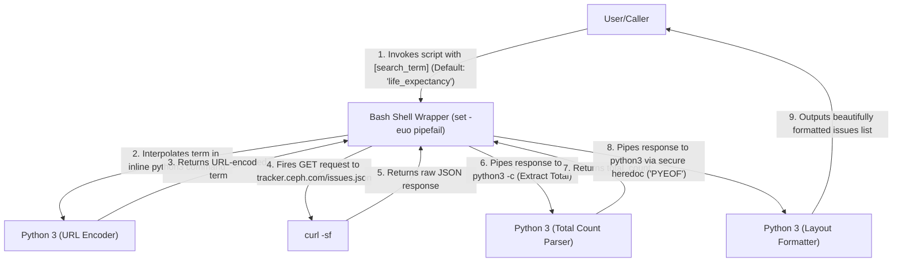
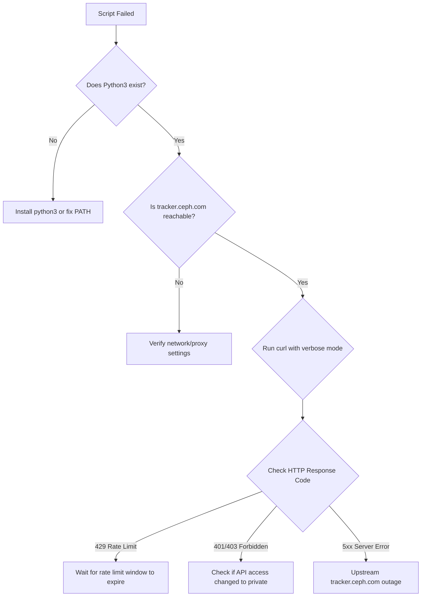

# Whiteboard Defense: `query_ceph_tracker.sh` (`scripts/query_ceph_tracker.sh`)

This document provides a comprehensive system architecture, technical defense, and risk-remediation specification for `scripts/query_ceph_tracker.sh`, conforming to the enterprise Whiteboard Defense standard.

---

## 1. High-Level Architecture & Mental Model

### System Overview
`query_ceph_tracker.sh` is a lightweight, low-dependency command-line utility designed to search the upstream public Ceph Redmine bug tracker (`tracker.ceph.com`) for issues related to device `life_expectancy` validation or arbitrary user-defined query terms. It acts as an orchestrator wrapper that coordinates raw Unix networking (`curl`) and inline script processing via Python 3 to parse and format JSON responses without requiring external heavy third-party parsing tools (like `jq`).

### Component Relationships & Execution Flow
The script delegates network requests and data processing through a pipeline:



#### Detailed Execution Sequence
1. **Shell Initialization**: Bash is loaded via `#!/usr/bin/env bash` and strictly configured using `set -euo pipefail`.
2. **Input Processing**: The first command-line argument `$1` is extracted. If omitted, it defaults to the literal string `"life_expectancy"` using Bash parameter expansion (`${1:-life_expectancy}`).
3. **URL Encoding**: Bash executes an inline Python 3 one-liner to URL-encode the query.
4. **API Invocation**: `curl` executes a GET request using Redmine’s JSON API format, searching for issues with matching subjects (`subject=~...`), limiting results to the first page of 25 issues (`limit=25`), and requesting all open and closed issues (`status_id=*`).
5. **JSON Extraction (Total Count)**: The raw response is piped into a Python inline command to extract the `total_count` field safely.
6. **JSON Formatting & Display**: The raw response is piped into a final Python multi-line script via a literal heredoc (`<<'PYEOF'`) which iterates through the issue elements, formats status and priority fields, constructs canonical URLs, and prints them to `stdout`.

---

## 2. Architectural Decisions & Trade-offs

### "Why X instead of Y?"

| Decision | Alternative Considered | Why "X" Was Chosen | Trade-offs & Risks of "X" |
| :--- | :--- | :--- | :--- |
| **Bash Shell Wrapper** | Pure Python 3 CLI | Lightweight, immediate startup. Minimizes boilerplate code. Avoids python importing overhead and allows fast, native Unix piping. | **Critical Security Vulnerability:** Inline shell variable interpolation into Python `-c` string commands leads to arbitrary code execution if inputs are malicious. |
| **Inline Python JSON Parsing** | `jq` (command-line JSON processor) | Guarantees zero external developer dependencies. Python 3 is pre-installed on virtually all modern systems (including minimal images like UBI9), whereas `jq` must be explicitly installed. | Bash-to-Python boundary logic is complex to secure. Execution of child Python processes incurs subshell fork overhead. |
| **`set -euo pipefail`** | Default Bash behavior | Fail-fast mechanics. Ensures any failure in curl, network DNS, or python processing immediately halts script execution, preventing cascade failures. | Masked status codes. Hard to gracefully recover from network retries or customize error messages without complex wrapping. |
| **`curl -sf`** | Standard `curl` | `-s` suppresses progress bars in logs. `-f` forces non-zero exit codes on HTTP errors (e.g., 500, 404), triggering the `set -e` abort. | `-f` hides the specific HTTP response payload returned by Redmine, making server-side failures harder to diagnose. |
| **Literal Heredoc (`<<'PYEOF'`)** | Expanded Heredoc (`<<PYEOF`) | Quoting the heredoc delimiter prevents Bash from interpolating variables or command substitutions, preserving python indentation and variables safely. | Prevents passing Bash variables directly into the Python script block; all communication must happen via standard input piping. |

---

## 3. Data Structures, Algorithms & Invariants

### Data Structures & In-Memory Layout
- **String Primitives**:
  - `BASE_URL`: Constant string (`https://tracker.ceph.com`).
  - `SEARCH_TERM`: Captured string argument.
  - `RESPONSE`: Entire raw JSON response buffered in shell memory. This stores the payload representing up to 25 issues, which is typically under 100KB.
- **Python-Internal Representation**:
  - `data`: Standard Python dictionary/map parsed via `json.load(sys.stdin)`.
  - `issues`: A Python list of dictionaries, representing the issue collection.
  - Formatted String templates: Padded string formatting (`f"  #{iid:6}  [{status:<12}]"`) for structured stdout layouts.

### Complexity & Limits
- **Time Complexity**:
  - Network: $\mathcal{O}(1)$ (Single HTTP Round-Trip with `limit=25`).
  - JSON Parsing: $\mathcal{O}(N)$ where $N$ is the number of characters in the API response.
  - Display: $\mathcal{O}(M)$ where $M$ is the number of issues (max 25).
- **Space Complexity**:
  - $\mathcal{O}(N)$ space to buffer the JSON payload in Bash variable memory and python object heap.

### Core Invariants & State Matrix
1. **Network Invariant**: The query is always focused on issue subjects using the tilde `~` operator (wildcard match in Redmine).
2. **Page Limit**: Results are strictly bound to a maximum pagination of 25.
3. **Status Inclusion**: Both open and closed issues are queried (`status_id=*`).

---

## 4. Threat Model & Adversarial Handling

### Vulnerability Analysis: Python Command Injection

#### The Vulnerability
In line 18, the script executes:
```bash
ENCODED=$(python3 -c "import urllib.parse; print(urllib.parse.quote('${SEARCH_TERM}'))")
```
This performs direct shell parameter interpolation (`${SEARCH_TERM}`) inside a double-quoted Python `-c` expression. 

If an attacker controls the input parameter (e.g., in a CI/CD environment or a web dashboard wrapping this script), they can inject single quotes and execute arbitrary Python code.

#### Proof of Concept (PoC)
If the caller executes:
```bash
./query_ceph_tracker.sh "'; import os; os.system('echo HACKED'); '"
```
The resulting command evaluated by Bash becomes:
```bash
python3 -c "import urllib.parse; print(urllib.parse.quote(''); import os; os.system('echo HACKED'); ''))"
```
The python interpreter will parse and execute `os.system('echo HACKED')`, allowing arbitrary code execution under the permissions of the executing user.

#### Mitigation Strategy
To secure this execution boundary, **never** interpolate shell variables directly inside Python executable strings. Instead, pass the shell variable as an environment variable or as a command-line argument to the python process:

*Secure Alternative (Environment Variable approach):*
```bash
ENCODED=$(SEARCH_TERM="$SEARCH_TERM" python3 -c "import os, urllib.parse; print(urllib.parse.quote(os.getenv('SEARCH_TERM', '')))")
```
*Secure Alternative (Argument Passing approach):*
```bash
ENCODED=$(python3 -c "import sys, urllib.parse; print(urllib.parse.quote(sys.argv[1]))" "$SEARCH_TERM")
```

### Heredoc Security
Line 33 uses a single-quoted heredoc delimiter:
```bash
echo "$RESPONSE" | python3 - <<'PYEOF'
```
This is safe because single-quoting `'PYEOF'` prevents Bash from performing any variable expansion inside the block. For instance, if the Python block had code containing `$` characters (like shell references) or backticks, Bash would ignore them and pass the literal characters to Python.

### Unexpected API Payloads
If an adversary compromises `tracker.ceph.com` or poisons the DNS, they could return malicious payloads:
- **Non-JSON Payloads**: If HTML or plaintext is returned, `json.load()` fails with `JSONDecodeError` and exits with code 1, which gracefully aborts the pipeline due to `pipefail` and `set -e`.
- **Missing Keys**: The script uses `.get()` defensively:
  ```python
  status   = issue.get("status", {}).get("name", "?")
  priority = issue.get("priority", {}).get("name", "?")
  ```
  If `status` is missing, `.get("status", {})` returns an empty dict, and the secondary `.get("name", "?")` returns `"?"`. This prevents `KeyError` crashes.
- **Large Payloads / DoS**: A malicious server could return a massive response (e.g., several gigabytes). Since `curl` reads the payload into memory via the `RESPONSE` variable, this could cause the machine to run out of memory (OOM).

---

## 5. Failure Modes, Edge Cases & Blast Radius

### Where This Script Fails

#### 1. DNS Resolution or Network Interruption
- **Mechanics**: If `tracker.ceph.com` is unreachable, `curl` exits with a non-zero status code (e.g., 6 or 7).
- **Result**: The execution terminates immediately because of `set -e` and `RESPONSE=$(...)`. No output is generated.

#### 2. Redmine Rate Limiting (HTTP 429) / Authentication Required (HTTP 401/403)
- **Mechanics**: If the public tracker institutes rate limits, the API will return HTTP status 429. Because `curl` is run with `-f`, it treats HTTP error codes (>= 400) as execution failures and exits with code 22.
- **Result**: The script terminates with no helpful logging, hiding the rate limiting message from the user.

#### 3. Hanging Connections
- **Mechanics**: There are no timeout parameters specified on the `curl` call. If the gateway establishes a connection but ceases transmitting data, `curl` will hang indefinitely.
- **Result**: Indefinite pipeline lockup, consuming a runner slot or shell process.

#### 4. Missing Dependencies (No Python3 in Environment)
- **Mechanics**: If python3 is not available in the path, the first inline evaluation will fail.
- **Result**: Immediate crash with `python3: command not found` and exit code 127.

### Blast Radius Analysis
Because this script only reads data from an external API and formats it to standard output:
- **State Changes**: Zero. No files are written, and no server state is modified.
- **System Footprint**: Temporary subshells and HTTP client connections.
- **Blast Radius**: Extremely small. A crash or failure is completely isolated to the calling shell session or pipeline runner.

---

## 6. Observability & Triage Playbook

### Diagnostic Signals & Troubleshooting Steps

If the script fails, follow these steps to isolate the issue:



### Playbook Diagnostics & Custom Tracing

#### 1. Test Network Connectivity
Verify if the target server is responsive and accepting connections:
```bash
curl -I https://tracker.ceph.com/issues.json
```

#### 2. Debug HTTP Transactions (Unmasking curl)
Since `-sf` silences errors, execute the `curl` manually with verbose mode enabled and without `-f` to inspect response headers and HTTP status codes:
```bash
curl -v -H "Content-Type: application/json" "https://tracker.ceph.com/issues.json?limit=1"
```

#### 3. Validate JSON Payloads manually
If formatting is failing, print the raw output to inspect the payload returned by the server:
```bash
curl -s "https://tracker.ceph.com/issues.json?limit=1"
```

---
*Made with IBM Bob*
</body>
